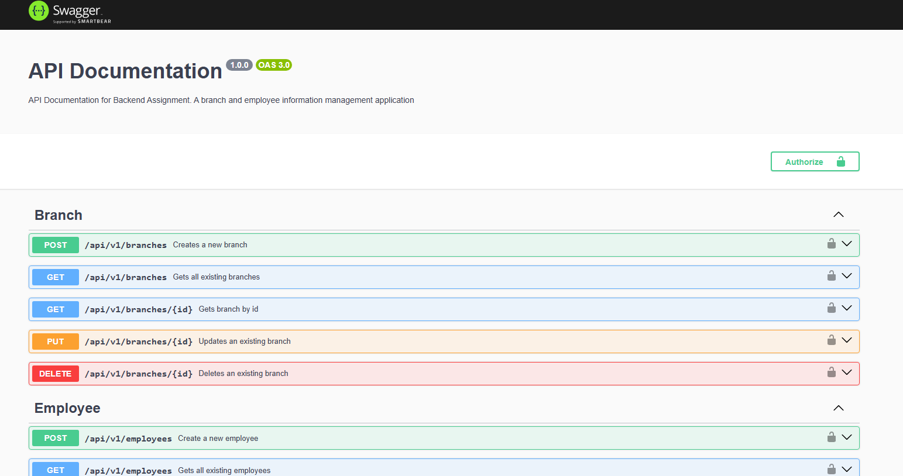
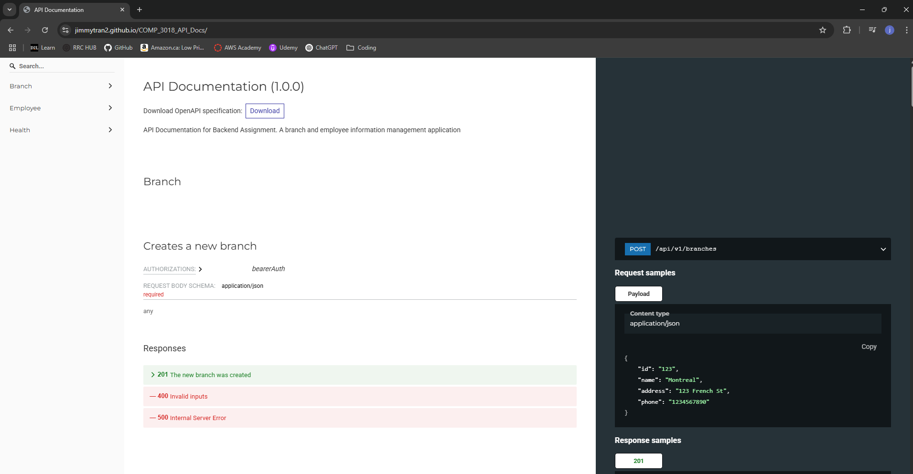
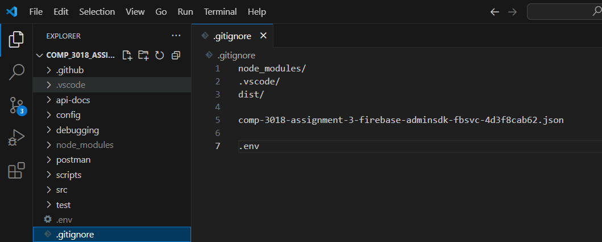

# Branch and Employee Management API

## COMP - 3018 - Back-End Development

This api allows users to create, get/retrieve, update and delete branches and employee records.
There are different endpoints for creating and managing the details for the branches and employees. Details for branches include id, name, and address. Details for employees include, name, department, position, and email. Useful for users or applications that are looking for a branch and employee information management tool.

## Install

- Node.js
- Git

## Setup

1. Clone this repo:

```
   git clone https://github.com/jimmytran2/COMP_3018_Assignment_03
   cd COMP_3018_Assignment_03
```

2. Install the required modules and packages

```
npm install
```

3. You will want to create ".env" file in the root. This is where you will place your environment variables. Place your corresponding credentials here. Be sure that the .env is added to a ".gitignore" file.

```
NODE_ENV=
PORT=3000
FIREBASE_PROJECT_ID=
FIREBASE_PRIVATE_KEY=
FIREBASE_CLIENT_EMAIL=
SWAGGER_SERVER_URL=
```

4. You can now start the application

```
npm start
```

## How to use this API

### Example request: POST - Create a new branch

Start your application

An example of a POST request script could look like this:

```js
const response = await fetch("http://localhost:3000/api/v1/branches", {
  method: "POST",
  headers: {
    "Content-Type": "application/json",
  },
  body: JSON.stringify({
    id: "123",
    name: "China",
    address: "123 Great Wall St",
    phone: "1234567890",
  }),
});
const data = await response.json();
console.log(data);
```

You should expect a response like this in your terminal:

```json
{
  "status": "success",
  "data": {
    "id": "123",
    "name": "China",
    "address": "123 Great Wall St",
    "phone": "1234567890"
  },
  "message": "Branch created"
}
```

### Example request: GET - Get all branches

Start your application

An example of a GET request script could look like this:

```js
const response = await fetch("http://localhost:3000/api/v1/branches", {
  method: "GET",
  headers: {},
});
const data = await response.json();
console.log(data);
```

You should expect a response like this in your terminal (depending on what your branches you have):

```json
{
  "status": "success",
  "data": [
    {
      "id": "HvbwzmVBkqAkove68KUs",
      "name": "calgary",
      "address": "123 rainbow St",
      "phone": "1234567890"
    },
    {
      "id": "V01OXjtQowI8GnenrAZq",
      "name": "vancouver",
      "address": "123 Smith St",
      "phone": "1234567890"
    },
    {
      "id": "Yzh15DsIivVHGqzh5CI8",
      "name": "Montreal",
      "address": "123 French St",
      "phone": "1234567890"
    },
    {
      "id": "123",
      "name": "China",
      "address": "123 Great Wall St",
      "phone": "1234567890"
    }
  ],
  "message": "Branches retrieved"
}
```

## Documentation

While application is running,

You can visit the following, to view API documentation (SwaggerUI): http://localhost:3000/api-docs/


More API documentation (GitHub Pages): https://jimmytran2.github.io/COMP_3018_API_Docs/


## Security

- Remember to create a .gitignore file, and place anything you dont want to commit to version control there. Examples are the .env file you created to store your environment variables, api-keys, and other other private information.


